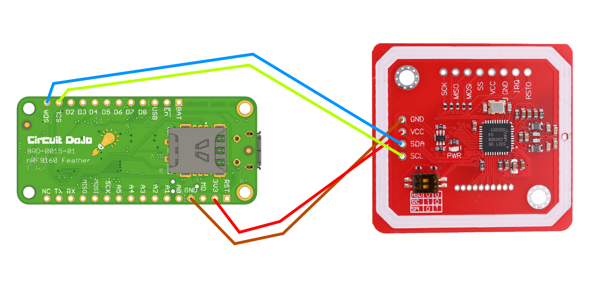

# Conencting the CircuitDojo nRF9160 Feather to the PN532 and LTE antenna.
1. To connect the feather to the PN532:
   1) Configure the PN532 to use I2C communication.
   2) Connect the device to the feather as such:
   
   
2. To connect the LTE antenna to the feather, find the RF port on the feather labeled `LTE`, and connect your antenna to it. No further configuration is needed.